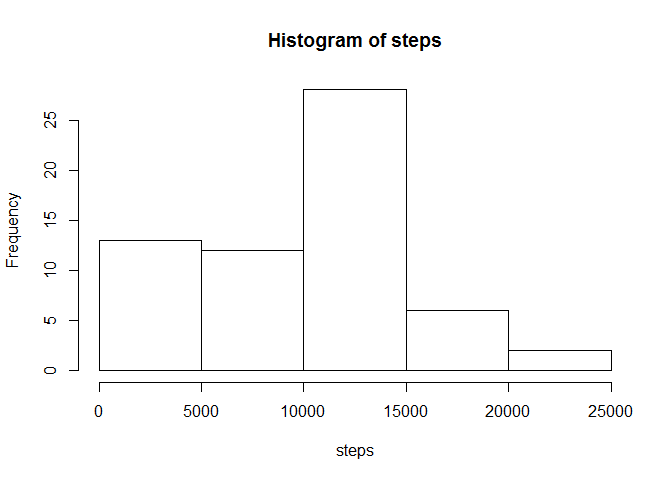
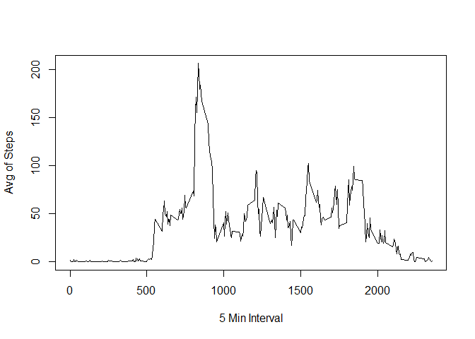
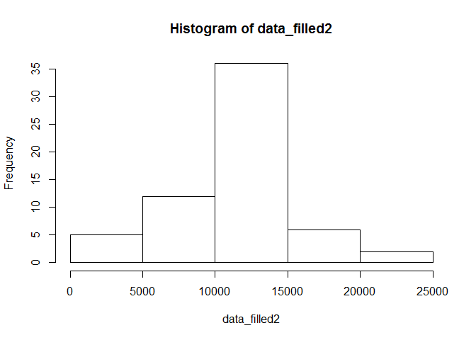
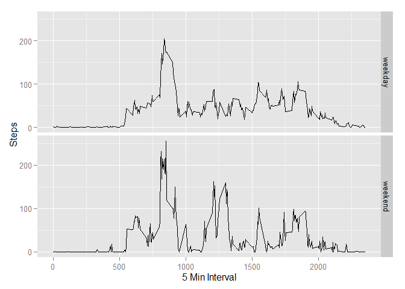

# RepData_PeerAssesment1
Jorge A Diaz Infante  
Tuesday, April 14, 2015  

Loading and preprocessing the data

```r
unzip("./data/activity.zip")
data <- read.csv("./data/activity.csv")
```

What is the mean and median total number of steps taken per day? 
Make a Histogram of the total numbers of steps taken each day

```r
steps <- tapply(data$steps, data$date, FUN = sum, na.rm = TRUE)
hist(steps)
```

 

```r
mean(steps, na.rm = TRUE)
```

```
## [1] 9354.23
```

```r
median(steps, na.rm = TRUE)
```

```
## [1] 10395
```

What is the average daily activity patter?

```r
avg_int <- aggregate(x = list(steps = data$steps), by = list(interval = data$interval), FUN = mean, na.rm = TRUE)
plot(avg_int$interval, avg_int$steps, type="l", xlab= "5 Min Interval", ylab= "Avg of Steps")
```

 


Which 5-minute interval, on average across all the days in the dataset, contains the maximum number of steps?

```r
avg_int[which.max(avg_int$steps),]
```

```
##     interval    steps
## 104      835 206.1698
```

Imputing missing values

Calculate and report the total number of missing values in the dataset (i.e. the total number of rows with NAs)

```r
sum(is.na(data$steps))
```

```
## [1] 2304
```

Devise a strategy for filling in all of the missing values in the dataset. 

```r
avg5 <- function(steps, interval) 
{
    filling <- NA
    if (is.na(steps)) 
    filling <- (avg_int[avg_int$interval == interval, "steps"])   
    else filling <- c(steps) 
    return(filling)
}
```

Create a new dataset that is equal to the original dataset but with the missing data filled in.

```r
data_filled <- data
data_filled$steps <- mapply(avg5, data_filled$steps, data_filled$interval)
```

Make a histogram of the total number of steps taken each day and Calculate and report the mean and median total number of steps taken per day.


```r
data_filled2 <- tapply(data_filled$steps, data_filled$date, FUN = sum, na.rm = TRUE)
hist(data_filled2)
```

 

```r
mean(data_filled2, na.rm = TRUE)
```

```
## [1] 10766.19
```

```r
median(data_filled2, na.rm = TRUE)
```

```
## [1] 10766.19
```

Do these values differ from the estimates from the first part of the assignment? What is the impact of imputing missing data on the estimates of the total daily number of steps? YES, Median and Mean are higer now that we use the average of the 5 min interval instead of NA (0)


Are there differences in activity patterns between weekdays and weekends?


Create a new factor variable in the dataset with two levels -- "weekday" and "weekend" indicating whether a given date is a weekday or weekend day.


```r
weekday <- function(date) 
{
    day <- weekdays(date)
    if (day %in% c("Saturday", "Sunday")) 
        return("weekend") else  
        return("weekday") 
}
data_filled$date <- as.Date(data_filled$date)
data_filled$day <- sapply(data_filled$date, FUN = weekday)
```

Make a panel plot containing a time series plot (i.e. type = "l") of the 5-minute interval (x-axis) and the average number of steps taken, averaged across all weekday days or weekend days (y-axis).


```r
avg_int_day <- aggregate(steps ~ interval + day, data = data_filled, mean)
library(ggplot2)
ggplot(avg_int_day, aes(interval, steps)) + geom_line() + facet_grid(day ~ .) + xlab("5 Min Interval") + ylab("Steps")
```

 


